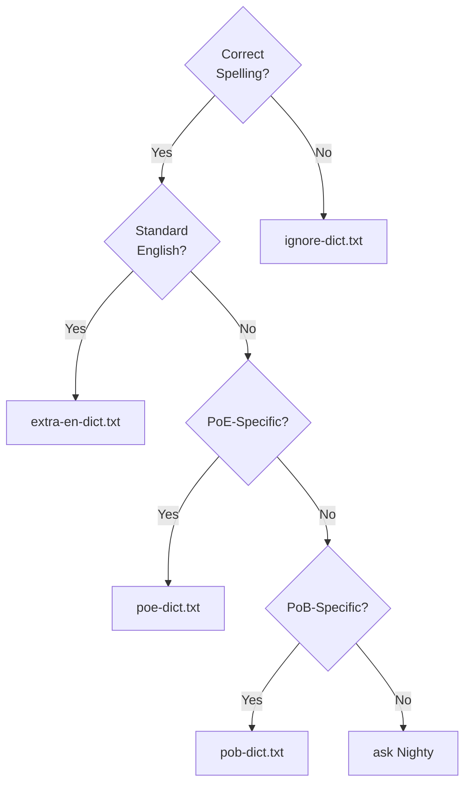

# pob-dict

Dictionaries and [Code Spell Checker](https://cspell.org/) (CSpell) config files for [Path Of Building Community](https://github.com/PathOfBuildingCommunity/PathOfBuilding) (PoB) code development. 

## Components
All `*-dict.txt` files consist of a single `LF`-terminated word per-line, sorted ascending case-insensitive, with `UTF-8` encoding. 

| Filename                       | Description
| ------------------------------ | -----------
| [cspell.json](cspell.json)   | CSpell settings.
| [poe-dict.txt](poe-dict.txt) | Words specific to [Path of Exile](https://www.pathofexile.com/).
| [pob-dict.txt](pob-dict.txt) | Words specific to PoB development and associated files.
| [ignore-dict.txt](ignore-dict.txt) | Words to be ignored by CSpell.
| [extra-en-dict.txt](extra-en-dict.txt) | Extra English words that are not in CSpell's dictionaries.
| [contribs-dict.txt](contribs-dict.txt) | GitHub contributor's login names.  Auto-generated, do not edit manually.
| [spellcheck.yml](docs/spellcheck.yml) | Example GitHub workflow using [`cspell-action`](https://github.com/streetsidesoftware/cspell-action).


## Installation

### PoB repo
* Copy `docs/spellcheck.yml` to `.github/workflows/` of the PoB repo.

This workflow is designed to be run from the PoB repo, collecting files from this repo as needed, and thus
avoids cluttering the PoB repo.  By default, the workflow automatically only checks changes made in pull-requests against the `dev` branch.  
It can also be triggered manually to perform a full check of a specific branch/tag/SHA.


### VSCode <sup><sub>(optional)</sub></sup>
* Install [Code Spell Checker](https://marketplace.visualstudio.com/items?itemName=streetsidesoftware.code-spell-checker).
* Checkout (or download & unzip) this repo to a directory that shares its parent dir with your PoB fork.
* Add the following lines to `.vscode/settings.json` in your PoB fork:
```json
{
  "CSpell.import": [ "../pob-dict/cspell.json" ],
  "CSpell.language": "en,en-GB"
}
```


### Command-line <sup><sub>(optional)</sub></sup>
* Install the [CSpell NPM package](https://www.npmjs.com/package/cspell).

To run a full scan of a local PoB fork with some helpful options enabled:
```powershell
PS C:\PathOfBuilding> cspell --config "..\pob-dict\cspell.json" --relative --show-context --no-progress "**"
```

## Dictionary additions
Which dictionary do I add this unrecognised word to?
* If it's spelled *correctly*, in the context of:
  * the game (Path of Exile) -> `poe-dict.txt`.
  * the PoB source code / git repository -> `pob-dict.txt`.
  * English, but missing from CSpell's dictionaries -> `extra-en-dict.txt`
* If it's spelled *incorrectly* or doesn't fit anywhere else, and/or you want to suppress the warning -> `ignore-dict.txt`.  
Note:  To reduce false negatives, please try to make this type of addition as specific as possible (see `CritsDontAlways` example below).
* If you're unsure, just ask me on Discord or open a [new issue](https://github.com/Nightblade/pob-dict/issues/new/choose).

### Examples
| Word              | Dictionary          | Reasoning
|-------------------|---------------------|------------------------------
| `Atziri`          | `poe-dict.txt`      | Correct spelling, PoE NPC.
| `REGENPERCENT`    | `pob-dict.txt`      | Correct spelling, combination of two words, used in PoB source code.
| `pregenerated`    | `extra-en-dict.txt` | Correct spelling, English word, not in CSpell's<br /> dictionaries.
| `CritsDontAlways` | `ignore-dict.txt`   | Incorrect spelling/punctuation, legacy GGG PoE game data.<br />Add the whole word so that *"Dont"* is still flagged elsewhere.

### Flowchart

---

## License

[MIT](https://opensource.org/licenses/MIT)
