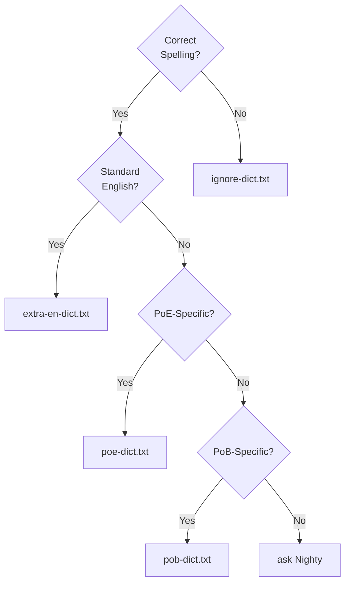

<!-- cspell:words contribs -->

# pob-dict

Dictionaries and [Code Spell Checker](https://cspell.org/) (CSpell) config files for [Path Of Building Community](https://github.com/PathOfBuildingCommunity/PathOfBuilding) (PoB) code development.

## Components

All `*-dict.txt` files contain a single word per line, `LF`-terminated, sorted ascending case-insensitive, `UTF-8` encoded.

| Filename | Description |
| -------------------------------- | ----------- |
| [cspell.json](cspell.json) | CSpell settings. |
| [poe-dict.txt](poe-dict.txt) | Words specific to [Path of Exile](https://www.pathofexile.com/). |
| [pob-dict.txt](pob-dict.txt) | Words specific to PoB development and associated files. |
| [ignore-dict.txt](ignore-dict.txt) | Words CSpell should ignore. |
| [extra-en-dict.txt](extra-en-dict.txt) | English words missing from CSpell's built-in dictionaries. |
| [contribs-dict.txt](contribs-dict.txt) | GitHub contributor login names. Workflow actions automatically add new contributors daily. |
| [spellcheck.yml](docs/spellcheck.yml) | Example GitHub workflow using [`cspell-action`](https://github.com/streetsidesoftware/cspell-action). |

## Installation

### PoB repo

Copy `docs/spellcheck.yml` to `.github/workflows/` in the PoB repo.

This workflow runs from the PoB repo and pulls files from this repo as needed, keeping the PoB repo uncluttered. By default it checks only changes in PRs against the `dev` branch. You can also trigger it manually to run a full check against a specific branch, tag, or SHA.

### VSCode <sup><sub>(optional)</sub></sup>

1. Install [Code Spell Checker](https://marketplace.visualstudio.com/items?itemName=streetsidesoftware.code-spell-checker).
2. Check out (or download and unzip) this repo.
3. Add to your `.vscode\settings.json`:

```json
{
  "CSpell.import": [ "C:\\POB_REPO_PATH\\pob-dict\\cspell.json" ],
  "CSpell.language": "en,en-GB,en-US"
}
```

### Command-line <sup><sub>(optional)</sub></sup>

1. Install the [CSpell NPM package](https://www.npmjs.com/package/cspell).
2. Run a full scan of a local PoB fork:

```powershell
PS C:\POB_REPO_PATH\PathOfBuilding> cspell --config "C:\POB_REPO_PATH\pob-dict\cspell.json" --relative --show-context --no-progress "**"
```

## Dictionary additions

| Word | Dictionary | Reasoning |
| ------------------- | ------------------- | --------- |
| `Atziri` | `poe-dict.txt` | Correct spelling, PoE-specific. |
| `REGENPERCENT` | `pob-dict.txt` | Correct spelling, (compound word) used in PoB source. |
| `pregenerated` | `extra-en-dict.txt` | Correct English word missing from CSpell's dictionaries. |
| `CritsDontAlways` | `ignore-dict.txt` | Incorrect punctuation, legacy GGG game data.<br /> Add the word with context so `Dont` still triggers elsewhere. |

If unsure, ask Nighty on Discord or open a [new issue](https://github.com/Nightblade/pob-dict/issues/new/choose).


```mermaid
flowchart TD
  correct{Correct\nSpelling?}
  correct -- Yes --> english
  correct -- No  --> ignore-dict.txt

  english{Standard\nEnglish?}
  english -- Yes --> extra-en-dict.txt
  english -- No  --> poe

  poe{PoE-Specific?}
  poe -- Yes --> poe-dict.txt
  poe -- No  --> pob

  pob{PoB-Specific?}
  pob -- Yes --> pob-dict.txt
  pob -- No  --> user_error[ask Nighty]
```

## License

[MIT](https://opensource.org/licenses/MIT)

